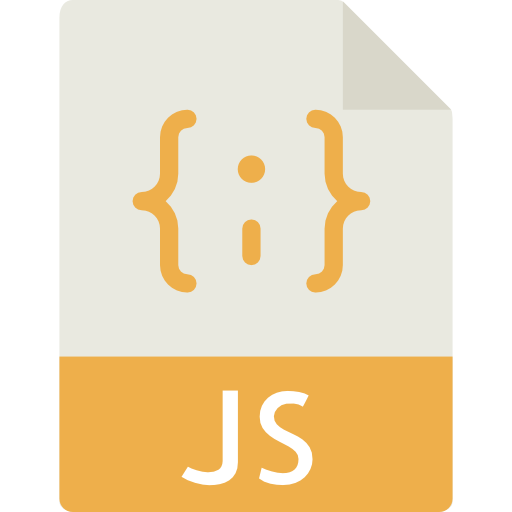

### Hi there 👋

I'm **Sudhir Gadhvi**, Founder & CEO at [KLYRO](https://klyro.tech),  a product studio that helps startups and enterprises scale their mobile and web applications.  
I lead product strategy and hands-on engineering across iOS, backend, and AI-driven systems.

Currently leading product and iOS development for [PicYourMoment](https://picyourmoment.nl/)** through KLYRO — helping scale to 750K+ users globally.

Before that, I worked on **[RosterBuster](https://apps.apple.com/us/app/rosterbuster-airline-crew-app/id1035558169#?platform=iphone)** at [CAE](https://www.cae.com/), one of the most widely used aviation crew apps globally.

- 🚀 Building digital products that scale at **KLYRO**
- 📈 Passionate about product-led growth, AI integrations, and mobile-first experiences
- 🧠 11+ years of hands-on experience across engineering, design, and product
- 📫 Reach me: **contact@klyro.tech**
- 🌏 Visit: [KLYRO](https://klyro.tech)

---

**Languages and Tools:**  

[][ios]
[][swift]
[][reactnative]
[][javascript]
[][vscode]
[][git]
[][firebase]
[][realm]
[][jira]

 
 

|  |  |
| ------------- | ------------- |

### Connect with me:
[][linkedin]

[linkedin]: https://www.linkedin.com/in/sudhirgadhvi
[swift]: https://docs.swift.org/swift-book/LanguageGuide/TheBasics.html
[ios]: https://developer.apple.com/ios/
[vscode]: https://code.visualstudio.com
[reactnative]: https://reactnative.dev
[javascript]: https://developer.mozilla.org/en-US/docs/Web/JavaScript
[git]: https://github.com/SudhirGadhvi/SudhirGadhvi/blob/main/README.md
[firebase]: https://firebase.google.com
[realm]: https://realm.io
[jira]: https://www.atlassian.com/software/jira
